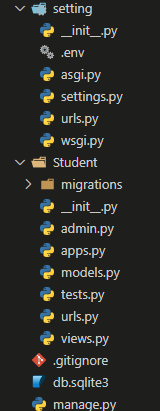
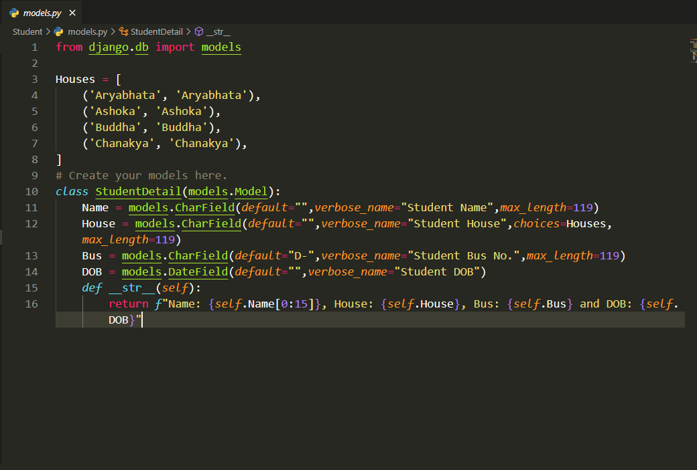
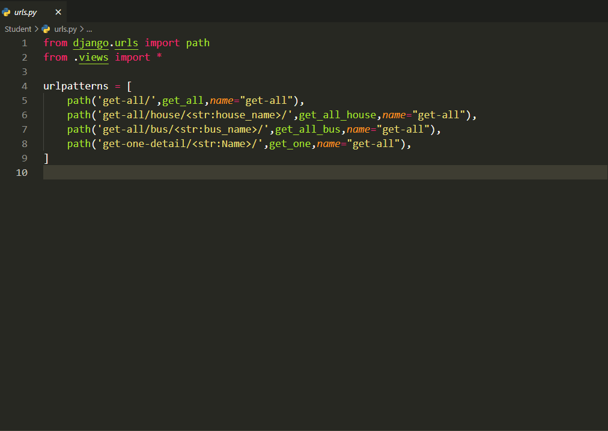
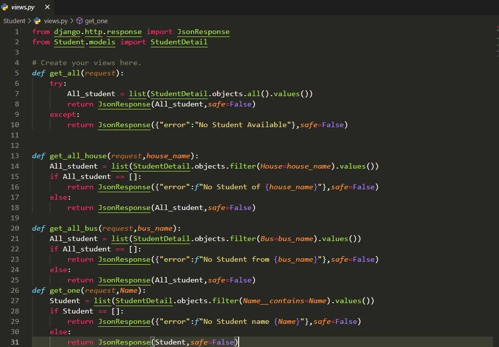

# Board Code prototype

## Features (Json Response)

- Get the Detail of all students
- Get the Detail of students according to house
- Get the Detail of students according to bus
- Get the Detail of one student by name

## How to get detail of all students

Make get request to ```get-all/``` to get detail of all students

## How to get detail of students according to House

Make get request to ```get-all/house/{housename}/``` to get detail of all students having same house.

## How to get detail of students according to Bus No.

Make get request to ```get-all/bus/{busno}/``` to get detail of all students having same Bus no.

## How to get detail of students by Student Name

Make get request to ```get-one-detail/{Studentname}/``` to get detail of a student. 
You can give a hint. Like i want detail of basant raj then i can give url as ```get-one-detail/ba/```
---
Folder Structure




# Model.py of Student

# urls.py of Student

# views.py of Student
